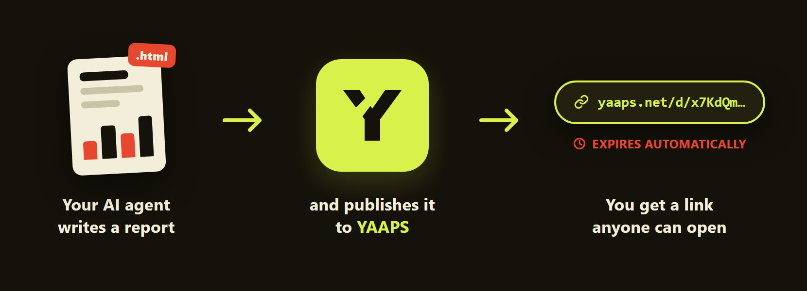

# YAAPS

YAAPS turns HTML reports created by AI agents into temporary, shareable links. The service runs at [https://yaaps.net](https://yaaps.net); the code is open and can also be self-hosted.



## Get started

1. Create an account at [yaaps.net](https://yaaps.net) with a passkey.
2. Install the YAAPS skill (below).
3. Ask your agent to connect to YAAPS, and approve the one-time request in your browser.
4. Ask the agent to publish a report; it returns a link you can open or share.

No API key ever passes through the chat: the agent's access is approved once in the browser and can be revoked at any time from the dashboard.

## Install the skill

Windows (PowerShell):

```powershell
irm 'https://yaaps.net/downloads/install-skill.ps1' | iex
```

macOS and Linux:

```sh
curl -fsSL 'https://yaaps.net/downloads/install-skill.sh' | sh
```

The installer detects Codex and Claude installations automatically and does not require Node.js or npm. A guided walkthrough, manual ZIP installation, and script review are available at [yaaps.net/connect](https://yaaps.net/connect).

## CLI

Prefer a command line? The same workflow is available as an npm package:

```sh
npm install -g yaaps-ai
yaaps connect --label "My agent"
yaaps publish ./report.html --title "Weekly report"
```

See the [CLI reference](packages/cli/README.md) for all commands.

## Features

- Provider-neutral Agent Skill with Windows, macOS, and manual installation paths.
- Passkey authentication, invitations, recovery codes, and revocable agent access, with optional open self-registration (`YAAPS_OPEN_REGISTRATION=true`).
- Owner-scoped reports with immutable versions, expiry controls, and public capability URLs.
- Strict report isolation that blocks scripts, forms, frames, plugins, and network requests.
- English and Hebrew interfaces with LTR, RTL, light, dark, desktop, and mobile support.
- HTTP API with OpenAPI 3.1, Swagger UI, and ReDoc documentation.
- SQLite metadata, immutable HTML storage, retention cleanup, and verified backup and restore operations.

## Self-hosting

Run the published image with Docker Compose behind an HTTPS reverse proxy. `docker-compose.yml` and `.env.example` in this repository are the deployment template, and [docs/operations.md](docs/operations.md) covers backup, restore, upgrade, and incident response.

## Documentation

- [Operations and backup](docs/operations.md)
- [CLI reference](packages/cli/README.md)
- [Development](docs/development.md)
- [Changelog](docs/CHANGELOG.md)

## License

[MIT](LICENSE)
